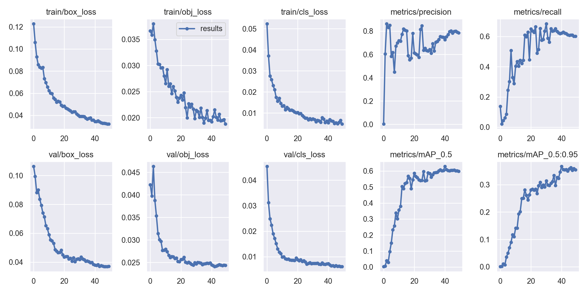

# Final Project Report
Final Project - Tramcar Railway Track Obstacles Detection

AU7009 Digital Image Processing, SJTU, 2022 Fall

By **Prof. L.S. Wang, T.Fang**

 

**Table of Contents**
<!-- MarkdownTOC -->

- [Problem Specification](#problem-specification)
- [Environment](#environment)
- [Implementation](#implementation)
  - [ROI Extraction](#roi-extraction)
  - [Track Detection](#track-detection)
  - [Object Detection](#object-detection)
  - [Overlapping Filtering](#overlapping-filtering)
- [Results](#results)
- [Appendix - Codes](#appendix---codes)

<!-- /MarkdownTOC -->

 

### Problem Specification
For the given videos taken by tachograph cameras installed on tramcars:

+ label data for model training & testing
+ design an algorithm to detect the railway tracks, and visualize
+ design an algorithm to detect the obstacles (e.g. pedestrians) on the detected railway tracks, and visualize
+ provide 1-2 results as videos, containing those at day-time and night-time, and each at a minimum length of 10 seconds

### Environment
+ OS: Windows 8.1 Pro (64-bit) (NO CUDA AVAILABLE)
+ Python 3.7.6

### Implementation

The pipeline of the system is shown as follows:

  

    
  

, which can be divided into four modules:
+ **ROI Extraction**: for an input video, **AUTOMATICALLY** calculate the railway track ROI (**R**egion-**O**f-**I**nterest), using morphology operations;
+ **Track Detection**: for the calculated ROI of a given video and an input image (as a frame of the video), detect the track region (**STRAIGHT OR CURVY**) and track-neighboring region, using morphology operations;
+ **Object Detection**: for an input image (as a frame of a video), detect all the objects
+ **Overlapping Filtering**: for an input video, detect the track and obstacles of the track regions and track-neighboring regions

The detailed motivation and implementation of the four modules, which ought to be insensitive to the time in a day, are elaborated as below.

#### ROI Extraction

ROI, or region-of-interest, in the context, refers to the region containing the railway track. 

Although we may desperately hand-craft the ROI, automatic extraction is preferred in wider applications, especially where the number of camera installation properties (e.g. camera parameters, installation location, etc.) is large.

Meanwhile, with regard to ROI, we observe that,
+ *trapezoid-shaped*: due to observing perspective, the bird-view rectangle ROI of "parallel" tracks appears to be a trapezoid in images captured by cameras;
+ *movement-free*: track before the tramcars are, in most cases, supposed to empty; while the rest regions might account for dramatic movements (e.g. cars). In other words, the to-be-extracted ROI is suppose to be static in movement;
+ *parallel movements*: since dramatic movements often result from vehicles on the roads "parallel" to the railway track, we may estimate edges of the trapezoid-shaped ROI by such movements

Therefore, To tackle the ROI-auto-detection problem, we propose the following steps:
1. apply optical flow to the whole video, to extract trace of the NOT *movement-free* regions;
2. apply Hough line transform to the movement traces, to extract the line-alike movement patterns;
3. find lines with the largest and smallest slope values, and regard their intersections as the vanishing point;
4. draft the triangle-shaped ROI by vertices: calculated vanishing point, bottom-left of the image and bottom-right of the image;
5. fine tune the ROI: by the empirically-selected up-edge length and empirically-selected bottom-edge shrinkage ratio, calculate the vertices of the *trapezoid-shaped* ROI.

Illustrations of the ROI extraction are shown as follows, 

  

    
    
  

where, 
+ FROM video TO (a): step #1
+ FROM (a) TO (b): step #2 (white lines) + step #3 (blue&green lines, red dot) + step #4 (red light-weight triangle) + step #5 (red bold trapezoid)
+ (c): ROI in straight tracks scenarios
+ (d): ROI in curvy tracks scenarios

#### Track Detection
Using the extracted ROI, we may ignore much noise irrelevant to tracks. 

Motivated by the perspective-strongly-related *trapezoid-shaped* observation, to detect tracks, we propose the following procedures:
1. apply Canny edge detection for a draft track. Notice that, by empirically thresholding the average V-channel of the HSV (hue, saturation, value) image representation, we may tell whether a frame is taken during day-time or night-time, and further assign different empirically-chosen double thresholds of Canny;
2. transform perspective to bird-view;
3. fit the curve of the railway track 
   + for the 1ST frame
     + apply third-degree polynomial (to handle curvy cases, otherwise, second-degree for straight ones works) regression onto the perspective-transformed ROI, to fit the curve of the railway track;
     + inverse-transform perspective of the fit track curve from bird-view and output the result;
   + for consecutive frames
     + apply regression onto neighbouring regions centered by the previous-frame-fit curve;
     + update if area of the track exceeds an empirically-given threshold;
4. expand the track regions to track-neighboring regions, which serve as early-warnings of potential obstacles
5. visualize

Illustrations of the track extraction are shown as follows, 

  

    
    
  

where, 
+ FROM video TO (a): step #1
+ FROM (a) TO (b): simple ROI maksing
+ FROM (b) TO (c): step #2
+ FROM (c) TO (d): 1ST-frame case of step #3
+ FROM (d) TO (e): step #4
+ FROM (e) TO (f): step #5, as result illustration

#### Object Detection

Intuitively, we may leverage YOLOs (e.g. YOLOv5s).

Before object detection, we pre-process images to remove the timestamps at the lower-right image, to fuel pattern-capturing. Steps are as follows:

1. manually assign timestamp ROIs (since such an ROI is always the same for a video provider):  brand-name text ROI (bold-weight text), date text ROI (light-weight text), speed&time text ROI (light-weight text);
2. apply thresholding by the L-channel of HLS (hue, lightness, saturation) image representation, with different empirically-chosen thresholds used for different ROIs, to extract text pixels;
3. combine masks of the three small ROIs, and masked off the original image;
4. apply dilating to the combined mask, to better capture all the text pixels;
5. apply `cv2.inpaint()` to approximately-fix the masked-off part, using the dilated mask, and output the text-removed result.

Illustrations of the text removal are shown as follows, 

  

    
    
  

where, 
+ FROM video TO (a): step #1
+ FROM (a) TO (b): step #2
+ FROM (b) TO (c): step #3
+ FROM (c) TO (d): step #4
+ FROM (d) TO (e): step #5
+ FROM (e) TO (f): result illustration

Then, we may apply object detection on the text-removed images.

As is required and considering the inference results, we ought to fine-tune YOLOv5s, using a customized dataset constructed from images taken during day-time and night-time. Therefore, we label objects in 362 images, where:
+ objects are (following COCO format): bus, car, motorcycle, person, train, truck;
+ images are sampled from `1.mp4` (day-time) and `6.mp4` (night-time), with text-removal pre-processing applied;

, and:

|       cnt       | day | night | total |
|:---------------:|:---:|:-----:|:-----:|
|       all       | 181 |  181  |  362  |
|   with objects  | 178 |  141  |  319  |
| without objects |  3  |   40  |   43  |
|  train set ($\approx 80\%$) | 145 |  114  |  259  |
|  valid set ($\approx 20\%$) |  33 |   27  |   60  |

Notice that, for simplicity, test set is NOT split. 

Labels distribution is shown as follows:

  

    
  

By fine-tune-training with `batch_size=16` for 50 epochs (for simplicity, and obviously, higher metrics might be achieved by training for more epochs), the metrics are shown as follows:

  

    
  

To best detect the objects in the images, we initially regard all the objects predicted by YOLOv5s and YOLOv5s-fine-tuned as valid, and then apply the following filtering:
+ for objects from YOLOv5s: keep objects with labels COCO-indexed 0-7 (person/bicycle/car/motorcycle/airplane/bus/train/truck) only;
+ for objects from YOLOv5s and YOLOv5s-fine-tuned: apply non-maximum-suppression, with empirically-chosen confidence threshold and IOU threshold.

Illustrations of the object detection (using text-removed images) are shown as follows, 

  

    
    
  

where, 
+ FROM video TO (a): step #1
+ FROM (a) TO (b): step #2
+ FROM (b) TO (c): step #3
+ FROM (c) TO (d): step #4
+ FROM (d) TO (e): step #5
+ FROM (e) TO (f): result illustration

#### Overlapping Filtering

To find obstacles, we combine the results of track detection (track regions and track-neighboring regions) and object detection (objects).

For all the detected objects, we calculate the area of its intersection with track regions ($A_t$) and track-neighboring regions ($A_{tr}$), and further,
+ mark an object as an obstacle iff. $A_t\geq thresh$;
+ mark an object as a potential obstacle iff. $A_t < thresh A_t$ and $A_{tr}\geq thresh$;

, where $thresh$ is an empirically-selected threshold.

Therefore, we may detect all the obstacles and potential obstacles of each frame in a vidoe.

Illustrations of the overlapping filtering are shown as follows, 

  

    
    
  

where, 
+ FROM video TO (a): step #1
+ FROM (a) TO (b): step #2
+ FROM (b) TO (c): step #3
+ FROM (c) TO (d): step #4
+ FROM (d) TO (e): step #5
+ FROM (e) TO (f): result illustration

 

### Results

Illustration of results of each module are given in the above implementation details.

Video Results are shipped with the report.

 

### Appendix - Codes

For detailed update logs, please check [Github Repository](https://github.com/marridG/2022-AU7009). **STARS ARE WELCOMED**.

Codes are also shipped with the report.
