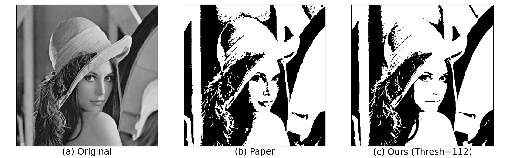
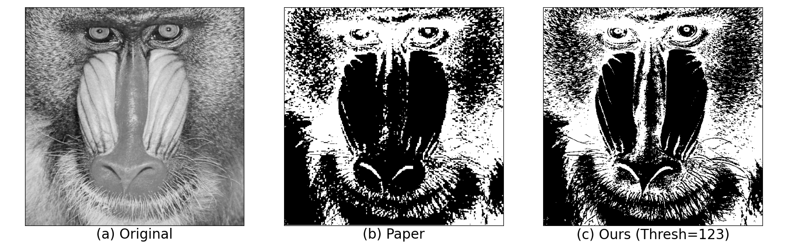
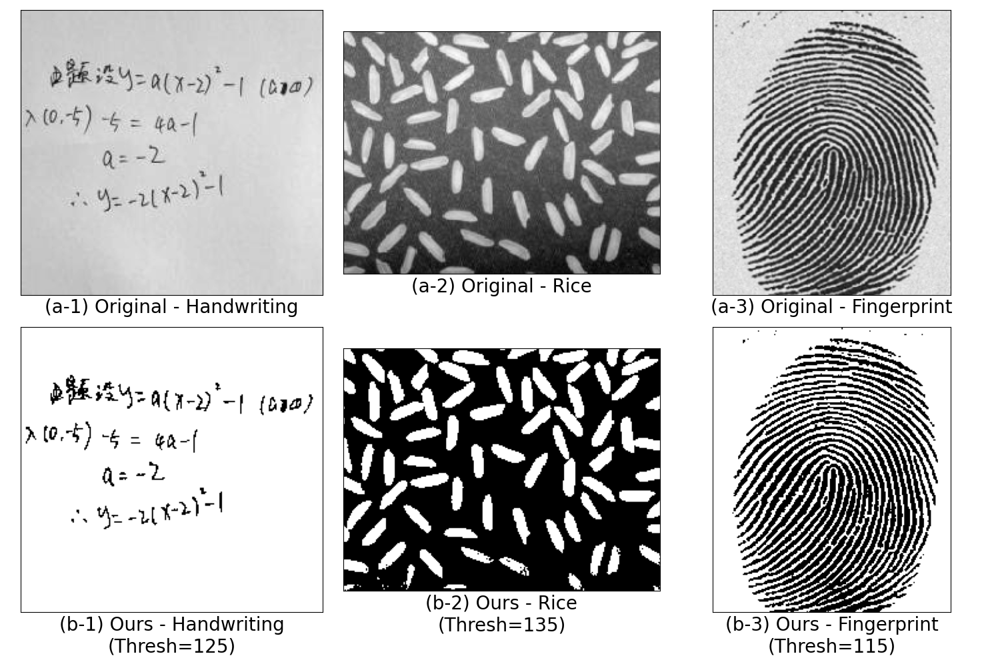
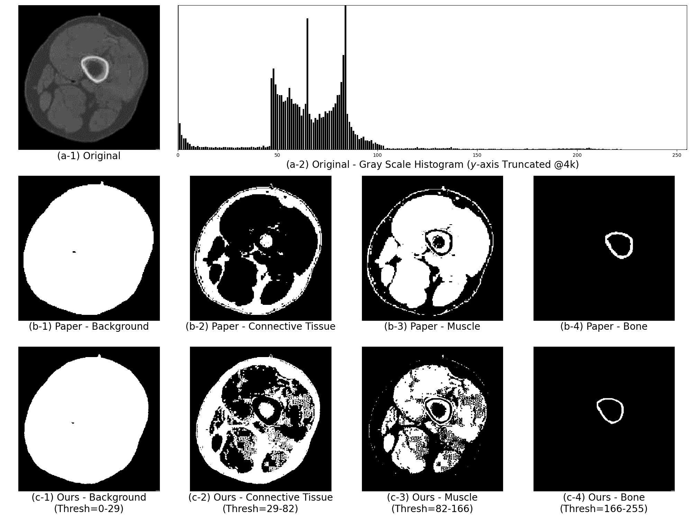
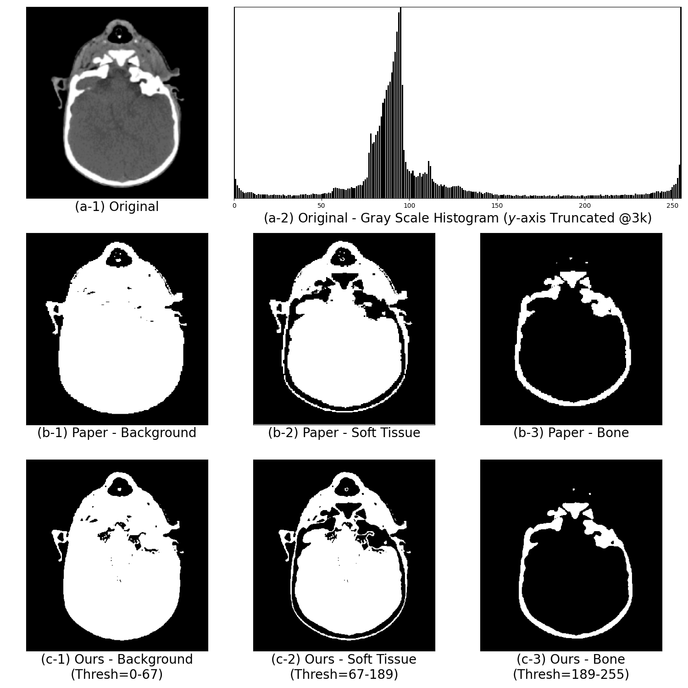

# Hw 1 Report - Thresholding
AU7009 Digital Image Processing, SJTU, 2022 Fall

By **Prof. L.S. Wang, T.Fang**

<br>

**Table of Contents**
<!-- MarkdownTOC -->

- [Hw 1 Report - Thresholding](#hw-1-report---thresholding)
    - [Problem Specification](#problem-specification)
    - [Environment](#environment)
    - [Implementation](#implementation)
      - [Bi-Level Threshold Selection](#bi-level-threshold-selection)
      - [Multi-Level Threshold Selection](#multi-level-threshold-selection)
    - [Results](#results)
      - [Bi-Level Threshold Selection](#bi-level-threshold-selection-1)
      - [Multi-Level Threshold Selection](#multi-level-threshold-selection-1)
      - [Discussion](#discussion)
    - [Appendix - Codes](#appendix---codes)

<!-- /MarkdownTOC -->


<br>


<a id="problem-specification"></a>
### Problem Specification
Implement the threshold selection algorithm proposed in the following paper:
> Wang, L. and Bai, J., 2003. Threshold selection by clustering gray levels of boundary. *Pattern Recognition Letters, 24*(12), pp.1983-1999.

Specifically, the lab consists of the following two tasks in difference scenarios:

+ **bi-level** threshold selection: for a given gray scale image, find one threshold $\psi$ (also in gray scale) to split the image into two "parts": (1) one for pixels having gray scale value $\geq \psi$ and $\leq 255$; (2) the other for those $< \psi$ and $\geq 0$.
+ **multi-level** threshold selection: similar to bi-level threshold selection, but to find $N$ threshold $0 \leq \psi_1 < \psi_2 < \cdots < \psi_N \leq 255$, in order to split into $N+1$ "parts": $[0, \psi_1)$; $[\psi_1, \psi_2)$; ... ; $[\psi_i, \psi_{i+1})$; ... ; $[\psi_{N-1}, \psi_{N})$; $[\psi_N, 255]$.

Notice that, apparently in problem formulation, the **multi-level** threshold selection is a general case for the **bi-level** threshold selection (with the latter setting $N=1$). However, the paper presented somehow different processing procedures (the former by sample clustering while the latter by calculating sample means), which could be further paraphrased. However, for consistency, we follow a similar separate-alike content organization.

<a id="environment"></a>
### Environment
+ OS: Windows 8.1 Pro (64-bit)
+ Python 3.7.6


<a id="implementation"></a>
### Implementation
As is described in the paper, the main concerns lie in: 
1. edge detection;
2. implementation of discrete sampling of boundary; 
3. (**multi-level** case only) clustering of the gray scale values of the discrete sampling of boundary

With hardly any details included in the original paper (or are rather out-dated), and for simplicity, we adopt the following apporaches to tackle the problems mentioned above in practice:
1. **for edge detection**: use Canny edge detection ([paper](https://ieeexplore.ieee.org/abstract/document/4767851), [OpenCV doc](https://docs.opencv.org/4.x/dd/d1a/group__imgproc__feature.html#ga04723e007ed888ddf11d9ba04e2232de), [OpenCV example](https://docs.opencv.org/4.x/da/d22/tutorial_py_canny.html)):
   + with parameters always chosen (as the default values) as: `threshold1 = 100, threshold2 = 200, apertureSize = 3, L2gradient = false`;
2. **for discrete sampling of boundary**: for a on-boundary pixel, include all its 8-adjacent neighbours (if existent) in the discrete sampling of boundary, because of the following considerations:
    + the pixel-grid itself is an intuitive form of the "regular grid of 2D image" (mentioned in Section 3, shown in Figure 4);
    + boundaries are represented by a set of pixels in the pixel grid
    + for a on-boundary pixel, its 8-adjacent (actually, 4-adjacent will also work) neighbours is a good interpretation of the points of an "*edge* intersected by a boundary" (quoted from Paragraph 4 of Section 3).
3. (**multi-level** case only) **for clustering**: use K-Means ([sklearn doc](https://scikit-learn.org/stable/modules/generated/sklearn.cluster.KMeans.html#sklearn.cluster.KMeans), [sklearn example](https://scikit-learn.org/stable/auto_examples/cluster/plot_kmeans_digits.html#sphx-glr-auto-examples-cluster-plot-kmeans-digits-py); [others](https://scikit-learn.org/stable/modules/clustering.html#overview-of-clustering-methods) might also work):
   + with parameters always chosen (almost as the default values) as: `n_clusters = INPUT, init = "k-means++", n_init = 10, max_iter = 300, tol = 1e-4, verbose = 0, random_state = 0, copy_xbool = True, algorithm = "lloyd"`
   + by the following steps: 
       + treat all the $K$ discrete boundary samples as a 1-D list of length $K$, and further transform into a 2-D array of shape $(K,1)$;
       + fit the K-Means model of $N$ clusters by the 2-D array;
       + extract predicted cluster labels of each sample;
       + calculate the centroids of each cluster by taking means of all its inner samples
       + export the $N$ centroids as the $N$ thresholds


By leveraging the modules implemented above, in face of the  **bi-level** threshold selection case as well as the **multi-level** threshold selection case, we have the following solutions:


<a id="bi-level-threshold-selection"></a>
#### Bi-Level Threshold Selection
Do the following steps:
+ read the target image $I$ as gray scale;
+ apply Canny edge detetcion onto $I$ and get a boundary mask $M$, where on-boundary pixels have value $255$ and off-boundary ones have value $0$;
+ initiate an empty list for discrete boundary sampling, say as $\mathcal{S}=\emptyset$;
+ iterate all pixels of $I$, for each pixel $p_{i,j}$ indexed $(i,j)$:
  + if $M_{i,j}$ is $0$, skip;
  + otherwise, add the gray scale value of all its existent 8-adjacent neighbours to $\mathcal{S}$;
+ calculate the mean $\overline{S}$ of all the values in $\mathcal{S}$;
+ output the result threshold as $\psi=\lfloor \overline{S} \rfloor$;

and further, apply thresholding (e.g. OpenCV `threshold()`, [doc](https://docs.opencv.org/4.x/d7/d1b/group__imgproc__misc.html#gae8a4a146d1ca78c626a53577199e9c57), [example](https://docs.opencv.org/4.x/d7/d4d/tutorial_py_thresholding.html))onto the original image $I$ to get binary illustrations of 2 parts.


<a id="multi-level-threshold-selection"></a>
#### Multi-Level Threshold Selection
Do the following steps:
+ read the target image $I$ as gray scale;
+ apply Canny edge detection onto $I$ and get a boundary mask $M$, where on-boundary pixels have value $255$ and off-boundary ones have value $0$;
+ initiate an empty list for discrete boundary sampling, say as $\mathcal{S}=\emptyset$;
+ iterate all pixels of $I$, for each pixel $p_{i,j}$ indexed $(i,j)$:
  + if $M_{i,j}$ is $0$, skip;
  + otherwise, add the gray scale value of all its existent 8-adjacent neighbours to $\mathcal{S}$;
+ use K-Means to map all the values in $\mathcal{S}$ into $N$ clusters $\mathcal{C_1}, \mathcal{C_2}, \cdots, \mathcal{C_N}$;
+ calculate the centroids $c_i$ of each cluster $\mathcal{C}_i$
+ output the result threshold as $\{ \psi_1, \cdots, \psi_N \}=\{ \lfloor \overline{c_i} \rfloor \vert \forall i \}$;

and further, apply gray scale range selection (e.g. OpenCV `inRange()`, [doc](https://docs.opencv.org/4.x/d2/de8/group__core__array.html#ga48af0ab51e36436c5d04340e036ce981), [example](https://docs.opencv.org/4.x/da/d97/tutorial_threshold_inRange.html)) onto the original image $I$ to get binary illustrations of $N+1$ parts.


<br>

<a id="results"></a>
### Results


<a id="bi-level-threshold-selection-1"></a>
#### Bi-Level Threshold Selection

For images used in the paper:

1. lady:
    <div align="center">
        
    </div>
2. baboon:
    <div align="center">
        
    </div>

For images not used in the paper:
    <div align="center">
        
    </div>


<a id="multi-level-threshold-selection-1"></a>
#### Multi-Level Threshold Selection

For images used in the paper:

1. leg CT:
    <div align="center">
        
    </div>
2. head CT:
    <div align="center">
        
    </div>


<a id="discussion"></a>
#### Discussion
From the above results (compare results captioned "Paper" with those captioned "Ours"), we may observe that,
+ in "ours" of lady, we observe fewer details on the upper-left part of the lady's hat;
+ for baboon, "paper" and "ours" are almost the same, except that "ours" have shallower strokes at the baboon's nose and upper-right hair;
+ for handwriting, rice and fingerprint, "ours" successfully extract the corresponding "main part", i.e., the written words, rice particles and fingerprint textures;
+ for leg CT, "paper" and "ours" of background are similar; "paper" provides heavier stroke in bone than "ours"; "paper" extracts less fine-grained textures of connective tissue and muscle in  than "ours" does;
+ for head CT, "paper" and "ours" of bone are similar; "paper" extracts less fine-grained textures of background and soft tissue than "ours" does.

from which, self-evidently, we may conclude that,

+ for images used in the paper, the slight difference in the thresholding results is intuitive outcome of:
  + **bi-level** case: the choice of the edge detection method (with corresponding parameters)
  + **multi-level** case: the choice of the edge detection method (with corresponding parameters) and the choice of the clustering method (with corresponding parameters)
+ however, even with the underlying difference choice of edge detection (and clustering) methods, the thresholding results are satisfactory enough and share similar characteristics. It further proves the claimed robustness to poor boundary sampling and noise.


<br>


<a id="appendix---codes"></a>
### Appendix - Codes
```Python
### trhesh.py ###
import cv2
import numpy as np
from sklearn.cluster import KMeans
from matplotlib import pyplot as plt


# class ThresholdSelector:
#     def __init__(self, img: str or np.ndarray):
#         # load/store gray scale img
#         if isinstance(img, str):
#             self.img = cv2.imread(fn, cv2.IMREAD_GRAYSCALE)
#         else:
#             assert 2 == len(img.shape), \
#                 "Input Image is Expected to be of Gray Scale having 2 Dimensions, Got %d Dimensions" % len(img.shape)
#             self.img = img
#
#         # params
#         self.params_canny_thresh_1 = 100
#         self.params_canny_thresh_2 = 200
#
#         # history
#         self.img_edge_detection = None
#         self.val_boundary_pts = []


def cal_thresh(img: np.ndarray, mask: np.ndarray = None, num_clusters: int = 0,
               debug=False, **kwargs) -> int or np.ndarray(dtype=int):
    height, width = img.shape  # (H, W)

    _img_copy = img.copy()
    if mask is None:
        mask = np.full_like(img, True)

    # ===1=== edge detection
    # canny edge detection: get gray scale edges (of shape (H,W); 0 for non-edge points, !0=255 for on-edge points)
    edges = cv2.Canny(
        image=_img_copy,
        threshold1=kwargs.get("canny_thresh_1", 100),
        threshold2=kwargs.get("canny_thresh_2", 200)
    )
    if debug is True:
        plt.imshow(edges, cmap="gray"), plt.show()

    # ===2=== discrete boundary sampling
    val_boundary_pts = []
    _adj_8_deltas = [
        (-1, 0), (1, 0), (0, -1), (0, 1),  # 4-adjacency
        (-1, -1), (-1, 1), (1, -1), (1, 1)
    ]
    for _height in range(height):
        for _width in range(width):
            # skip if the pixel is masked off
            if 0 == mask[_height, _width]:  # note: True/False will be cast to 1/0
                continue
            # skip if the pixel is NOT on the edges
            if 0 == edges[_height, _width]:
                continue

            # for on-edge points: add values of its 8-adj points if existent
            for __adj_8_delta in _adj_8_deltas:
                __adj_pt_h = _height + __adj_8_delta[0]
                __adj_pt_w = _width + __adj_8_delta[1]
                # check for existence: whether is out-of-range
                if __adj_pt_h < 0 or __adj_pt_h >= height or __adj_pt_w < 0 or __adj_pt_w >= width:
                    continue

                # check for existence: whether is masked off
                if 0 == mask[__adj_pt_h, __adj_pt_w]:  # note: True/False will be cast to 1/0
                    continue
                val_boundary_pts.append(img[__adj_pt_h, __adj_pt_w])

    val_boundary_pts = np.array(val_boundary_pts)
    if debug is True:
        res_histogram = np.zeros(shape=(256,))
        for _val in val_boundary_pts:
            res_histogram[_val] += 1
        plt.bar(range(256), res_histogram, color="black"), plt.show()

    # ===3=== clustering (if necessary)
    # when NO clustering is required
    if num_clusters <= 1:
        res_thresh = np.mean(val_boundary_pts)
        res_thresh = int(res_thresh)
    # when clustering is required
    else:
        kmeans_operator = KMeans(n_clusters=num_clusters, random_state=kwargs.get("kmeans_random_state", 0))
        kmeans_cluster_labels = kmeans_operator.fit_predict(val_boundary_pts.reshape(-1, 1))  # vals: (N,) -> (N,1)
        # find cluster centroids
        kmeans_cluster_centroids = []
        for _cluster_idx in range(num_clusters):  # (N,)
            _cluster_vals = val_boundary_pts[np.where(_cluster_idx == kmeans_cluster_labels)]
            _cluster_vals_mean = np.mean(_cluster_vals).astype(int)
            kmeans_cluster_centroids.append(_cluster_vals_mean)
        kmeans_cluster_centroids.sort()
        print("Cluster Centroids:", kmeans_cluster_centroids)
        res_thresh = np.array(kmeans_cluster_centroids, dtype=int)

    if debug is True:
        print("Threshold:", res_thresh)
    return res_thresh


def gen_gray_scale_histogram(img: np.ndarray, debug=False, **kwargs) -> np.ndarray:
    height, width = img.shape  # (H, W)

    res_histogram = np.zeros(shape=(256,))
    for _height in range(height):
        for _width in range(width):
            _gray_val = img[_height, _width]
            res_histogram[_gray_val] += 1

    if debug is True:
        plt.bar(range(256), res_histogram, color="black"), plt.show()
    if kwargs.get("do_norm") is True:
        res_histogram /= img.size
    return res_histogram
```

```Python
### res_1_stage_w_gr.py ###
import os
import cv2
from matplotlib import pyplot as plt

from thresh import cal_thresh

img_fns = ["images/1_gray.bmp", "images/13.bmp", ]
img_gr_fns = ["images/1_gray_gr.PNG", "images/13_gr.PNG", ]
thresh_schema = [
    {"ori": cv2.THRESH_BINARY_INV, "gr": cv2.THRESH_BINARY_INV, "ours": cv2.THRESH_BINARY_INV},
    {"ori": cv2.THRESH_BINARY, "gr": cv2.THRESH_BINARY_INV, "ours": cv2.THRESH_BINARY}
]

PLT_FONT_SIZE_SUBPLOT_TITLE = 20
PLT_FONT_SIZE_SUBPLOT_XLABEL = 20

for _img_fn, _img_gr_fn, _thresh_schema in zip(img_fns, img_gr_fns, thresh_schema):
    assert os.path.exists(_img_fn)
    assert os.path.exists(_img_gr_fn)

    _img = cv2.imread(_img_fn, cv2.IMREAD_GRAYSCALE)
    _thresh = cal_thresh(img=_img)
    _, _img_thresh = cv2.threshold(_img, thresh=_thresh, maxval=255, type=_thresh_schema["ours"])

    # === show plots ===
    fig, ax = plt.subplots(1, 3, figsize=(16, 5))
    # original: gray scale
    # _, _img_binary = cv2.threshold(_img, thresh=127, maxval=255, type=_thresh_schema["ori"])
    ax[0].imshow(_img, cmap="gray")
    # ax[0].set_title("Original", fontsize=PLT_FONT_SIZE_SUBPLOT_TITLE)
    ax[0].set_xlabel("(a) Original", fontsize=PLT_FONT_SIZE_SUBPLOT_XLABEL)
    ax[0].set_xticks([]), ax[0].set_yticks([])
    # ground truth: gray scale -> binary
    _img_gr = cv2.imread(_img_gr_fn, cv2.IMREAD_GRAYSCALE)
    _, _img_gr_binary = cv2.threshold(_img_gr, thresh=127, maxval=255, type=_thresh_schema["gr"])
    ax[1].imshow(_img_gr_binary, cmap="binary")
    # ax[1].set_title("Paper", fontsize=PLT_FONT_SIZE_SUBPLOT_TITLE)
    ax[1].set_xlabel("(b) Paper", fontsize=PLT_FONT_SIZE_SUBPLOT_XLABEL)
    ax[1].set_xticks([]), ax[1].set_yticks([])
    # ours: binary
    ax[2].imshow(_img_thresh, cmap="binary")
    # ax[2].set_title("Ours (Thresh=%d)" % _thresh, fontsize=PLT_FONT_SIZE_SUBPLOT_TITLE)
    ax[2].set_xlabel("(c) Ours (Thresh=%d)" % _thresh, fontsize=PLT_FONT_SIZE_SUBPLOT_XLABEL)
    ax[2].set_xticks([]), ax[2].set_yticks([])

    plt.tight_layout()
    plt.show()
```

```Python
### res_1_stage_wo_gr.py ###
import os
import cv2
from matplotlib import pyplot as plt

from thresh import cal_thresh

img_fns = ["images/6.jpg", "images/8_gray.bmp", "images/14.bmp"]
img_titles = ["Handwriting", "Rice", "Fingerprint"]

PLT_FONT_SIZE_SUBPLOT_TITLE = 20
PLT_FONT_SIZE_SUBPLOT_XLABEL = 20

fig, ax = plt.subplots(2, 3, figsize=(15, 10))
ax = ax.flatten()
for _img_idx, _img_fn in enumerate(img_fns):
    _img_title = img_titles[_img_idx]
    _ax_idx_ori = 0 + _img_idx
    _ax_idx_ours = 3 + _img_idx
    _ax_label_idx = _img_idx + 1
    assert os.path.exists(_img_fn)

    _img = cv2.imread(_img_fn, cv2.IMREAD_GRAYSCALE)
    _thresh = cal_thresh(img=_img)
    _, _img_thresh = cv2.threshold(_img, thresh=_thresh, maxval=255, type=cv2.THRESH_BINARY_INV)

    # === show plots ===
    # original: gray scale
    # _, _img_binary = cv2.threshold(_img, thresh=127, maxval=255, type=_thresh_schema["ori"])
    ax[_ax_idx_ori].imshow(_img, cmap="gray")
    # ax[_ax_idx_ori].set_title("Original", fontsize=PLT_FONT_SIZE_SUBPLOT_TITLE)
    ax[_ax_idx_ori].set_xlabel("(a-%d) Original - %s" % (_ax_label_idx, _img_title),
                               fontsize=PLT_FONT_SIZE_SUBPLOT_XLABEL)
    ax[_ax_idx_ori].set_xticks([]), ax[_ax_idx_ori].set_yticks([])
    # ours: binary
    ax[_ax_idx_ours].imshow(_img_thresh, cmap="binary")
    # ax[_ax_idx_ours].set_title("Ours (Thresh=%d)" % _thresh, fontsize=PLT_FONT_SIZE_SUBPLOT_TITLE)
    ax[_ax_idx_ours].set_xlabel("(b-%d) Ours - %s\n(Thresh=%d)" % (_ax_label_idx, _img_title, _thresh),
                                fontsize=PLT_FONT_SIZE_SUBPLOT_XLABEL)
    ax[_ax_idx_ours].set_xticks([]), ax[_ax_idx_ours].set_yticks([])

plt.tight_layout()
plt.show()
```

```Python
### res_2_stage_wr_gr_head.py ###
import os
import cv2
import numpy as np
from matplotlib import pyplot as plt

from thresh import cal_thresh, gen_gray_scale_histogram

img_fn = "images/22.bmp"
img_gr_fns = ["images/22_gr_1.PNG", "images/22_gr_2.PNG", "images/22_gr_3.PNG"]
img_gr_labels = ["Background", "Soft Tissue", "Bone"]
NUM_CLUSTER = 2

PLT_FONT_SIZE_SUBPLOT_TITLE = 20
PLT_FONT_SIZE_SUBPLOT_XLABEL = 20

assert os.path.exists(img_fn)
assert all([os.path.exists(_img_gr_fn) for _img_gr_fn in img_gr_fns])

img = cv2.imread(img_fn, cv2.IMREAD_GRAYSCALE)
# view histogram
img_gray_histogram = gen_gray_scale_histogram(img=img)

# thresh selection by clustering
thresh_list = cal_thresh(img=img, num_clusters=NUM_CLUSTER)  # , **{"canny_thresh_1": 100, "canny_thresh_2": 200})
thresh_range_list = [0] + list(thresh_list) + [255]
img_res_cluster_0 = cv2.inRange(img, 0 * 1., thresh_list[0] * 1.)
img_res_cluster_1 = cv2.inRange(img, thresh_list[0] * 1., thresh_list[1] * 1.)
img_res_cluster_2 = cv2.inRange(img, thresh_list[1] * 1., 255 * 1.)
img_res_list = [img_res_cluster_0, 255 - img_res_cluster_1, 255 - img_res_cluster_2]

# === show plots (with merged subplots) ===
fig, _ax = plt.subplots(3, NUM_CLUSTER + 1, figsize=(5 * (NUM_CLUSTER + 1), 15))
gs = _ax[0, 1].get_gridspec()
for ax in _ax[0, 1:]:  # remove the underlying axes
    ax.remove()
axbig = fig.add_subplot(gs[0, 1:])
ax = _ax.flatten()

# [0] original: gray scale
# _, img_binary = cv2.threshold(img, thresh=127, maxval=255, type=thresh_schema["ori"])
ax[0].imshow(img, cmap="gray")
# ax[0].set_title("Original", fontsize=PLT_FONT_SIZE_SUBPLOT_TITLE)
ax[0].set_xlabel("(a-1) Original", fontsize=PLT_FONT_SIZE_SUBPLOT_XLABEL)
ax[0].set_xticks([]), ax[0].set_yticks([])

# [1-2] histogram
axbig.bar(range(256), img_gray_histogram, color="black")
axbig.set_xlabel("(a-2) Original - Gray Scale Histogram ($y$-axis Truncated @3k)", fontsize=PLT_FONT_SIZE_SUBPLOT_XLABEL)
# axbig.set_xticks([])
axbig.set_yticks([])
axbig.set_xlim(0, 255), axbig.set_ylim(0, 3000)

# [3-5] ground truth: gray scale -> binary
for _gr_idx, _gr_fn in enumerate(img_gr_fns):
    _ax_idx = 3 + _gr_idx
    _ax_label = "(b-%d) Paper - %s" % (_gr_idx + 1, img_gr_labels[_gr_idx])

    _img_gr = cv2.imread(_gr_fn, cv2.IMREAD_GRAYSCALE)
    _, _img_gr_binary = cv2.threshold(_img_gr, thresh=127, maxval=255, type=cv2.THRESH_BINARY_INV)
    ax[_ax_idx].imshow(_img_gr_binary, cmap="binary")
    # ax[_ax_idx].set_title(_ax_label, fontsize=PLT_FONT_SIZE_SUBPLOT_TITLE)
    ax[_ax_idx].set_xlabel(_ax_label, fontsize=PLT_FONT_SIZE_SUBPLOT_XLABEL)
    ax[_ax_idx].set_xticks([]), ax[_ax_idx].set_yticks([])

# [6-8] ours: binary
for _res_idx, _res in enumerate(img_res_list):
    _ax_idx = 6 + _res_idx
    _ax_label = "(c-%d) Ours - %s\n(Thresh=%d-%d)" % (
        _res_idx + 1, img_gr_labels[_res_idx],
        thresh_range_list[_res_idx], thresh_range_list[_res_idx + 1]
    )

    ax[_ax_idx].imshow(_res, cmap="binary")
    # ax[_ax_idx].set_title(_ax_label, fontsize=PLT_FONT_SIZE_SUBPLOT_TITLE)
    ax[_ax_idx].set_xlabel(_ax_label, fontsize=PLT_FONT_SIZE_SUBPLOT_XLABEL)
    ax[_ax_idx].set_xticks([]), ax[_ax_idx].set_yticks([])
# ax[-1].imshow(img_copy, cmap="gray")

plt.tight_layout()
plt.show()
```

```Python
### res_2_stage_w_gr_leg.py ###
import os
import cv2
import numpy as np
from matplotlib import pyplot as plt

from thresh import cal_thresh, gen_gray_scale_histogram

img_fn = "images/23.bmp"
img_gr_fns = ["images/23_gr_1.PNG", "images/23_gr_2.PNG", "images/23_gr_3.PNG", "images/23_gr_4.PNG"]
img_gr_labels = ["Background", "Connective Tissue", "Muscle", "Bone"]
NUM_CLUSTER = 3

PLT_FONT_SIZE_SUBPLOT_TITLE = 20
PLT_FONT_SIZE_SUBPLOT_XLABEL = 20

assert os.path.exists(img_fn)
assert all([os.path.exists(_img_gr_fn) for _img_gr_fn in img_gr_fns])

img = cv2.imread(img_fn, cv2.IMREAD_GRAYSCALE)
# view histogram
img_gray_histogram = gen_gray_scale_histogram(img=img)

# thresh selection by clustering
thresh_list = cal_thresh(img=img, num_clusters=NUM_CLUSTER)  # , **{"canny_thresh_1": 100, "canny_thresh_2": 200})
thresh_range_list = [0] + list(thresh_list) + [255]
img_res_cluster_0 = cv2.inRange(img, 0 * 1., thresh_list[0] * 1.)
img_res_cluster_1 = cv2.inRange(img, thresh_list[0] * 1., thresh_list[1] * 1.)
img_res_cluster_2 = cv2.inRange(img, thresh_list[1] * 1., thresh_list[2] * 1.)
img_res_cluster_3 = cv2.inRange(img, thresh_list[2] * 1., 255 * 1.)
img_res_list = [img_res_cluster_0, 255 - img_res_cluster_1, 255 - img_res_cluster_2, 255 - img_res_cluster_3]

# === show plots (with merged subplots) ===
fig, _ax = plt.subplots(3, NUM_CLUSTER + 1, figsize=(5 * (NUM_CLUSTER + 1), 15))
gs = _ax[0, 1].get_gridspec()
for ax in _ax[0, 1:]:  # remove the underlying axes
    ax.remove()
axbig = fig.add_subplot(gs[0, 1:])
ax = _ax.flatten()

# [0] original: gray scale
# _, img_binary = cv2.threshold(img, thresh=127, maxval=255, type=thresh_schema["ori"])
ax[0].imshow(img, cmap="gray")
# ax[0].set_title("Original", fontsize=PLT_FONT_SIZE_SUBPLOT_TITLE)
ax[0].set_xlabel("(a-1) Original", fontsize=PLT_FONT_SIZE_SUBPLOT_XLABEL)
ax[0].set_xticks([]), ax[0].set_yticks([])

# [1-3] histogram
axbig.bar(range(256), img_gray_histogram, color="black")
axbig.set_xlabel("(a-2) Original - Gray Scale Histogram ($y$-axis Truncated @4k)", fontsize=PLT_FONT_SIZE_SUBPLOT_XLABEL)
# axbig.set_xticks([])
axbig.set_yticks([])
axbig.set_xlim(0, 255), axbig.set_ylim(0, 4000)

# [4-7] ground truth: gray scale -> binary
for _gr_idx, _gr_fn in enumerate(img_gr_fns):
    _ax_idx = 4 + _gr_idx
    _ax_label = "(b-%d) Paper - %s" % (_gr_idx + 1, img_gr_labels[_gr_idx])

    _img_gr = cv2.imread(_gr_fn, cv2.IMREAD_GRAYSCALE)
    _, _img_gr_binary = cv2.threshold(_img_gr, thresh=127, maxval=255, type=cv2.THRESH_BINARY_INV)
    ax[_ax_idx].imshow(_img_gr_binary, cmap="binary")
    # ax[_ax_idx].set_title(_ax_label, fontsize=PLT_FONT_SIZE_SUBPLOT_TITLE)
    ax[_ax_idx].set_xlabel(_ax_label, fontsize=PLT_FONT_SIZE_SUBPLOT_XLABEL)
    ax[_ax_idx].set_xticks([]), ax[_ax_idx].set_yticks([])

# [8-11] ours: binary
for _res_idx, _res in enumerate(img_res_list):
    _ax_idx = 8 + _res_idx
    _ax_label = "(c-%d) Ours - %s\n(Thresh=%d-%d)" % (
        _res_idx + 1, img_gr_labels[_res_idx],
        thresh_range_list[_res_idx], thresh_range_list[_res_idx + 1]
    )

    ax[_ax_idx].imshow(_res, cmap="binary")
    # ax[_ax_idx].set_title(_ax_label, fontsize=PLT_FONT_SIZE_SUBPLOT_TITLE)
    ax[_ax_idx].set_xlabel(_ax_label, fontsize=PLT_FONT_SIZE_SUBPLOT_XLABEL)
    ax[_ax_idx].set_xticks([]), ax[_ax_idx].set_yticks([])
# ax[-1].imshow(img_copy, cmap="gray")

plt.tight_layout()
plt.show()
```
