# Hw 2 Report - Image Processing
AU7009 Digital Image Processing, SJTU, 2022 Fall

By **Prof. L.S. Wang, T.Fang**

 

**Table of Contents**
<!-- MarkdownTOC -->

- [Hw 2 Report - Image Processing](#hw-2-report---image-processing)
    - [Problem Specification](#problem-specification)
    - [Environment](#environment)
    - [Implementation](#implementation)
      - [TASK 1: Gaussian Smoothing - Implementation V.S. OpenCV](#task-1-gaussian-smoothing---implementation-vs-opencv)
      - [TASK 2-1: Sobel - Implementation V.S. OpenCV](#task-2-1-sobel---implementation-vs-opencv)
      - [TASK 2-2: Laplacian - Implementation V.S. OpenCV](#task-2-2-laplacian---implementation-vs-opencv)
      - [TASK 2-3: LoG - Implementation V.S. OpenCV](#task-2-3-log---implementation-vs-opencv)
      - [TASK 2-4: Canny - Implementation V.S. OpenCV](#task-2-4-canny---implementation-vs-opencv)
      - [TASK 3: Region Growing Algorithm - Implementation](#task-3-region-growing-algorithm---implementation)
      - [TASK 4: Split and Merge Algorithm - Implementation](#task-4-split-and-merge-algorithm---implementation)
    - [Experiment \& Discussion](#experiment--discussion)
      - [TASK 1: Gaussian Smoothing](#task-1-gaussian-smoothing)
      - [TASK 2-1: Sobel](#task-2-1-sobel)
      - [TASK 2-2: Laplacian](#task-2-2-laplacian)
      - [TASK 2-3: LoG](#task-2-3-log)
      - [TASK 2-4: Canny](#task-2-4-canny)
      - [TASK 3: Region Growing Algorithm](#task-3-region-growing-algorithm)
      - [TASK 4: Split and Merge Algorithm](#task-4-split-and-merge-algorithm)
    - [Appendix](#appendix)
      - [Codes](#codes)
      - [Reference](#reference)

<!-- /MarkdownTOC -->

 

### Problem Specification
Implement and analyze the following image processing methods on a selected set of images (easy + complex + noisy):

+ **[TASK 1] Gaussian Smoothing** (Gaussian Blur)
  + **implement**/test
  + demonstrate using kernels of size $5\times5$, $7\times7$, $11\times11$, $15\times15$, $19\times19$
  + observe & analyze:
    + effect of kernel sizes
+ **[TASK 2-1] Sobel**: an operator for gradient-based edge-detection
  + **implement**/test
  + observe/analyze
    + thick boundaries
    + sensitivity to noise
    + boundary connectivity and region closure
+ **[TASK 2-2] Laplacian**: an operator for 2nd-order gradient-based edge-detection
  + **implement**/test
  + observe/analyze
    + thick boundaries
    + sensitivity to noise
    + boundary connectivity and region closure
    + response to various gray scale gradients (especially w.r.t. details & non-boundary pixels)
+ **[TASK 2-3] LoG** (Gaussian blur + Laplacian): an operator for gradient-based edge-detection
  + **implement**/test
  + observe/analyze
    + demonstrate using kernels (Gaussian blur kernels) of different sizes
    + suppression w.r.t. details and noise, using differnt kernel sizes
    + boundaries drifting, using differnt kernel sizes
    + response to small gray scale gradients, using differnt kernel sizes
    + double-boundary phenomenon of the zero-crossing
  + try
    + apply a high gradient threshold to remove fake boundaries
    + acquire single-pixel-wide boundaries
+ **[TASK 2-4] Canny**: a pipeline for decent edge-detection
  + **implement**/test
  + observe/analyze
    + effect of lightening boundaries, by applying NMS (non-maximum suppression)
    + effect of highlighting boundaries, by applying double-thresholding
    + overall effect, by applying double-thresholding & single-low-thresholding & single-high-thresholding
    + overall effect, by applying Gaussian blur using kernels of different sizes
+ **[TASK 3] Region Growing Algorithm**: an algorithm for edge-detection-related purposes
  + **implement**/test
  + observe/analyze
    + overall effect, by using different thresholds
    + overall effect of simple & complex images 
+ **[TASK 4] Split and Merge Algorithm**: an algorithm for edge-detection-related purposes
  + **implement**/test
  + observe/analyze
    + overall effect of simple & complex images

### Environment
+ OS: Windows 8.1 Pro (64-bit)
+ Python 3.7.6

### Implementation

The image chosen for implementation illustration is `1_gray-2.bmp`.

An implementation is given for each of the above methods, and will be compared with that of OpenCV.

#### TASK 1: Gaussian Smoothing - Implementation V.S. OpenCV

  

    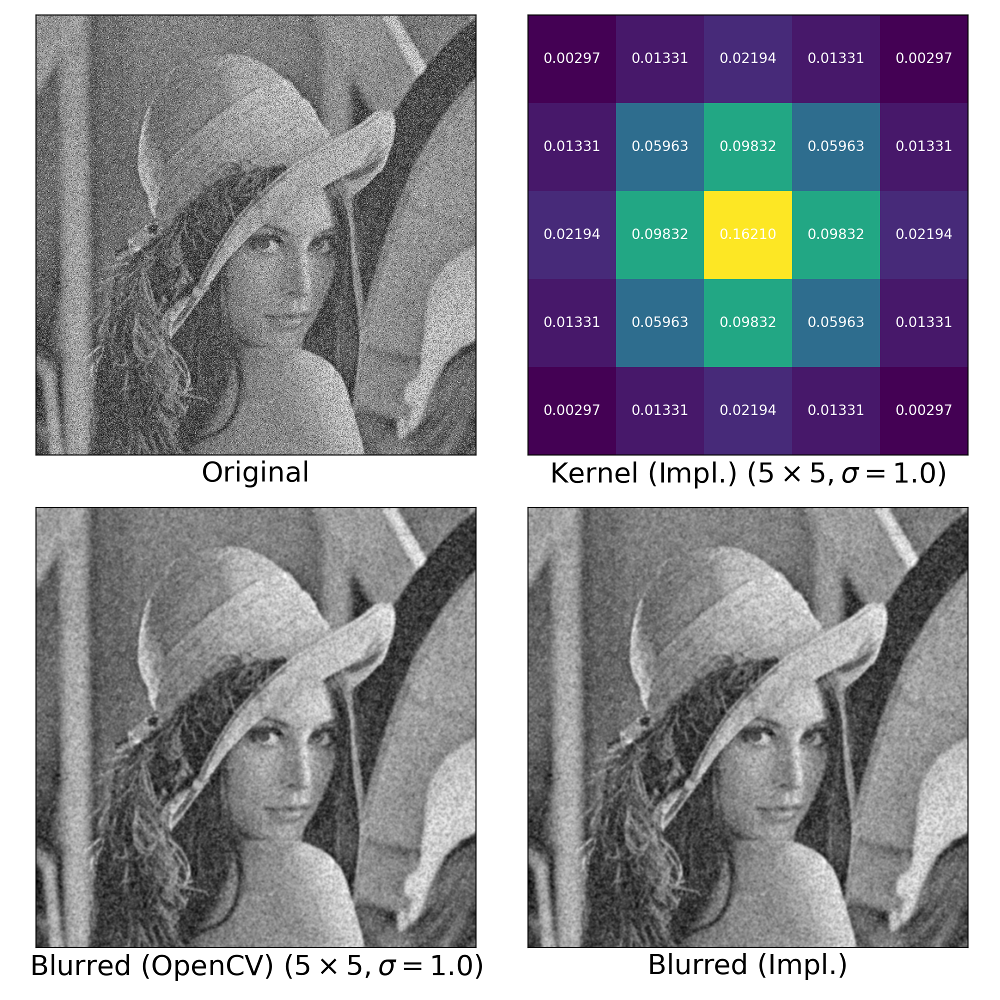
  

  From the above demonstartion, we may observe that the implemented version behaves almost the same as that through direct OpenCV utilities call. Therefore, further expreiments will be comitted using OpenCV, to best utilize the features of this method.

#### TASK 2-1: Sobel - Implementation V.S. OpenCV
  

    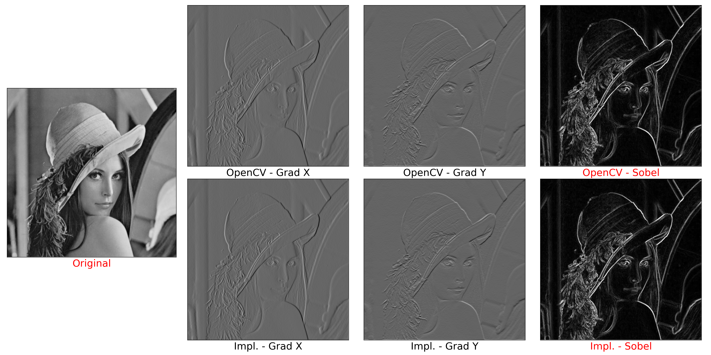
  

  
  From the above demonstartion, we may observe that the implemented version behaves almost the same as that through direct OpenCV utilities call. Therefore, further expreiments will be comitted using OpenCV, to best utilize the features of this method.

#### TASK 2-2: Laplacian - Implementation V.S. OpenCV
  

    
  

  From the above demonstartion, we may observe that the implemented version behaves almost the same as that through direct OpenCV utilities call. Therefore, further expreiments will be comitted using OpenCV, to best utilize the features of this method.

#### TASK 2-3: LoG - Implementation V.S. OpenCV
  

    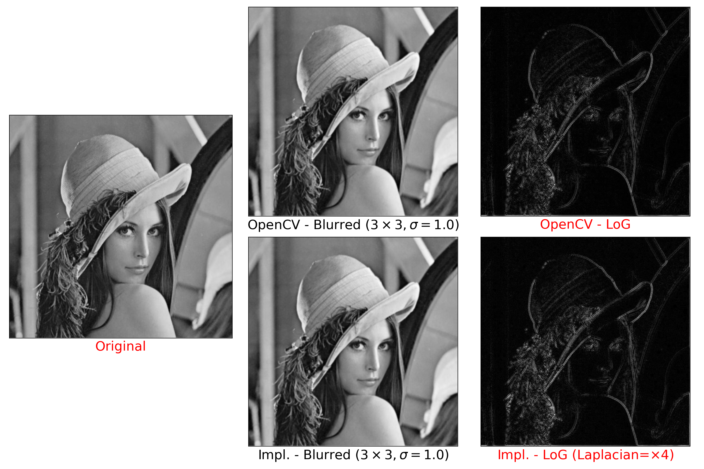
  

  From the above demonstartion, we may observe that the implemented version behaves almost the same as that through direct OpenCV utilities call. Therefore, further expreiments will be comitted using OpenCV, to best utilize the features of this method.

    

#### TASK 2-4: Canny - Implementation V.S. OpenCV
  Note
  + implementation of Canny consists of two groups:
    + labeled with prefix `OpenCV - `: if OpenCV provides utility calls, all are used (w.r.t., e.g., Gaussian blur, Sobel, thresholding, etc.)
    + labeled with prefix `Impl. - `: all operations are implemented
  + double thresholding illustration is generated by:
    + setting strong boundaries as gray scale value `255`
    + setting weak boundaries as gray scale value `128`
    + setting all the other pixesl as gray scale value `0`

  

    
  

  From the above demonstartion, we may observe that the implemented version behaves similar to that through direct OpenCV utilities call, but differently in the following aspects:
  + result image of OpenCV end-to-end exhibits more details
    + `OpenCV End-to-End (100/50)` V.S. `Hysteresis`
    + even `OpenCV End-to-End (100/50)` V.S. `OpenCV - Thresh (100/50)` or `Impl. - Thresh (100/50)`
  
  , which, might result from some unknown optimization adopted by the OpenCV's `Canny()`. However, considering the satisfactory enough results of the implemented version, we regard it a success.
  
  Therefore, further expreiments will be comitted using OpenCV, to best utilize the features of this method.

#### TASK 3: Region Growing Algorithm - Implementation
  Note
  + `Start=MIN/MAX` means: the starting location is chosen automatically, as the first maximum/minimun point in gray scale values. The exact indexes are shown in figures.
  + the similarity function is defined as: $|f(new)-f(old)|$, where,
    + $f(\cdot)$ extracts the gray scale value of the operand pixel
    + $|\cdot|$ is the absolute-value function
  + region growing criteria is definded as:
    + for the current pixel $p$, reach out for each of its 8-adjacent neighbours $p_i$
    + calculate $\Delta = |f(p)-f(p_i)|$
    + add $p_i$ to the grown region set iff. $\Delta < T_0$, where $T_0$ is the empirically set threshold

  

    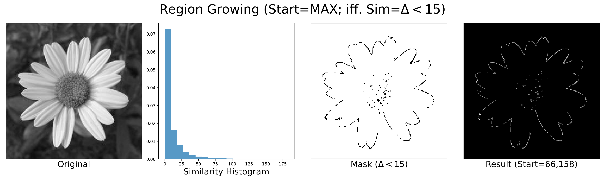
  

  
    From the above demonstartion, we may observe that the implemented version behaves satisfactory enough. Therefore, further expreiments will be comitted using such a version.

#### TASK 4: Split and Merge Algorithm - Implementation
  Note
  + predicate $P$ of a region $R$ containing pixels $\{r_1, r_2,\cdots, r_{|R|}\}$ is defined as: $P(R) = 1_{std(\{\forall r_i\}) \leq T_0 }$, where,
    + $std(\cdot)$ calculates the standard deviation
    + $T_0$ is an empirical threshold
  + for merging (iff. $P(R)=True$), set the region as gray scale value `255`
  
  

    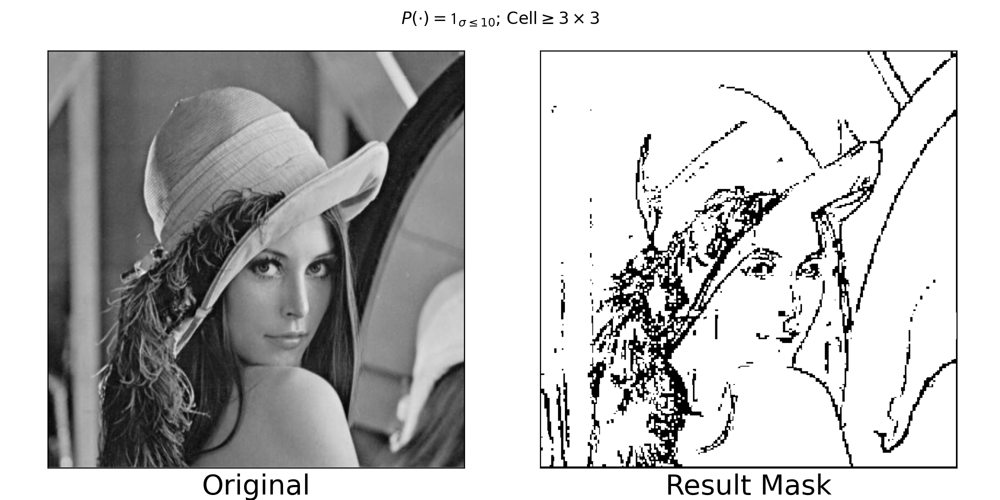
  

  From the above demonstartion, we may observe that the implemented version behaves satisfactory enough. Therefore, further expreiments will be comitted using such a version.

 

### Experiment & Discussion

The images chosen for illustration are `简单图像3.jpg` (easy), `1_gray-2.bmp` (complex) and `gray高斯噪声3-1.jpg` (noisy).

#### TASK 1: Gaussian Smoothing
> --- Gaussian Blur

>  + demonstrate using kernels of size $5\times5$, $7\times7$, $11\times11$, $15\times15$, $19\times19$
>  + observe & analyze:
>    + effect of kernel sizes

  

    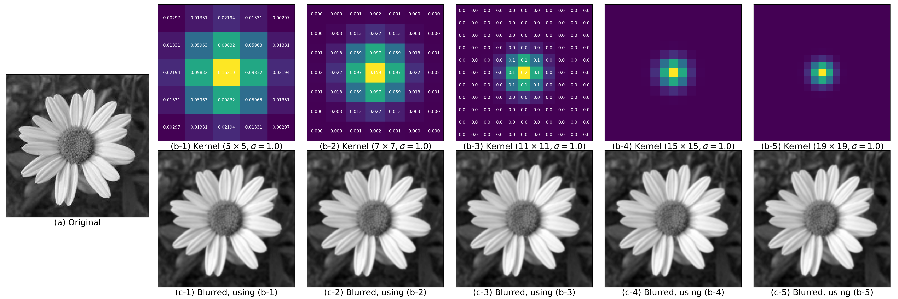
    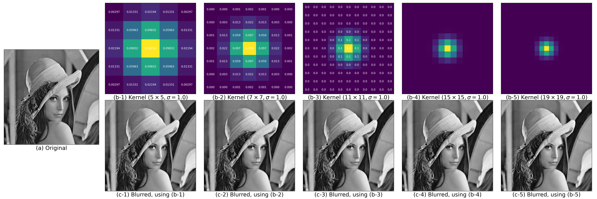
    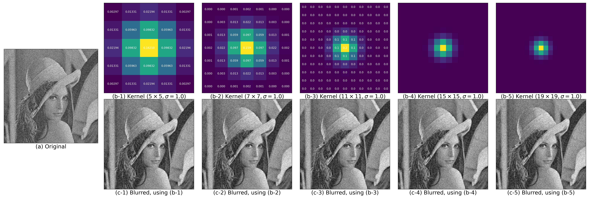
  

From the above figures, we may observe that

+ generally speaking, the larger the kernel size, the fewer deatils are shown in the blurred result
+ Guassian blur de-noise images with Gaussian noise well

#### TASK 2-1: Sobel
> --- an operator for gradient-based edge-detection

>  + observe/analyze
>    + thick boundaries
>    + sensitivity to noise
>    + boundary connectivity and region closure

  

    
  

From the above figures, we may observe that

+ explicit thick boundaries are shown
+ Sobel is sensitive to noise (to an intermediate extent), as shown in the result of the image with Gaussian noise
+ if without noise, boundaries are connected and are forming a good region closure

#### TASK 2-2: Laplacian
> --- an operator for 2nd-order gradient-based edge-detection

>  + observe/analyze
>    + thick boundaries
>    + sensitivity to noise
>    + boundary connectivity and region closure
>    + response to various gray scale gradients (especially w.r.t. details & non-boundary pixels)

  

    
  

From the above figures, we may observe that

+ explicit thick boundaries are shown
+ Laplacian is extremely sensitive to noise (after all, it is 2nd-order-based), as shown in the result of the image with Gaussian noise
+ if without noise, boundaries are connected and are forming a good region closure
+ Laplacian suppresses weak gray scale gradients, based on observations: (1) boudaries (locations where gray scale gradients varies greatly) are less distinctive (lighter) than those of Sobel; (2) some "bakcground detailed boundaries" are gone.

#### TASK 2-3: LoG
> --- (Gaussian blur + Laplacian): an operator for gradient-based edge-detection

>  + observe/analyze
>    + demonstrate using kernels (Gaussian blur kernels) of different sizes
>    + suppression w.r.t. details and noise, using differnt kernel sizes
>    + boundaries drifting, using differnt kernel sizes
>    + response to small gray scale gradients, using differnt kernel sizes
>    + double-boundary phenomenon of the zero-crossing

  

    
  

From the above figures, we may observe that

+ generally speaking, kernel sizes have little influence on the result, but slightly clearer details of main object's boundaries may be observed as the kernel sizes increase
+ Gaussian blur suppresses (almost regardless of the kernel sizes)
  + details (small gray scale gradients)
  + the noise that is disastrous to Laplacian
+ boundary drifting is unnoticeable
+ double-boundary phenomenon is observed

>  + try
>    + apply a high gradient threshold to remove fake boundaries

  

    
  

From the above figures, we may observe that

+ by applying a higher gradient threshold, fake boundaries are suppressed at a greater extent than true ones, at the cost of diconnecting boundaries and losing details
+ the higher the threshold is, the more distinct true boundaries are, and the fewer details are shown

>  + try
>    + acquire single-pixel-wide boundaries

Therefore, motivated by Canny, we apply double-thresholding instead of single-thresholding, to try acquiring single-pixel-wide boundaries (& balance details, w.r.t. boundary- & non-boundart- pixels). The results (labeled as `(a/b/c-6) LoG + Thresh (%d/%d)`) are improved, compared with those of LoG only (labeled as `(a/b/c-2) LoG (...)`).

  

    
  

#### TASK 2-4: Canny
> --- a pipeline for decent edge-detection

>  + observe/analyze
>    + effect of lightening boundaries, by applying NMS (non-maximum suppression)
>    + effect of highlighting boundaries, by applying double-thresholding

  

    
  

From the above figures (re-shown here, the same as those at the implementation demonstration), we may observe that

+ NMS effectively suppresses insignificant boundaries
+ double thresholding highlights the most significant boundaries (as strong ones, assigned gray scale value `255`) and "suppresses" the significant but not the most significant ones (as weak ones, assigned gray scale value `128`)

>  + observe/analyze
>    + overall effect, by applying double-thresholding & single-low-thresholding & single-high-thresholding

  

    
  

From the above figures, we may observe that

+ single-low-thresholding keeps the most details and suppresses the most the highlighting of main object's boundaries
+ single-high-thresholding keeps the fewest details and suppresses the least the highlighting of main object's boundaries
+ double-thresholding is a trade-off, which balancing details and the highlighting of main object's boundaries

>  + observe/analyze
>    + overall effect, by applying Gaussian blur using kernels of different sizes

  

    
  

From the above figures, we may observe that

+ kernel sizes have little influence on the overall effect
+ slight details decrease may be observes with the increase of kernel sizes

#### TASK 3: Region Growing Algorithm
> --- an algorithm for edge-detection-related purposes

>  + observe/analyze
>    + overall effect of simple & complex images 

  

    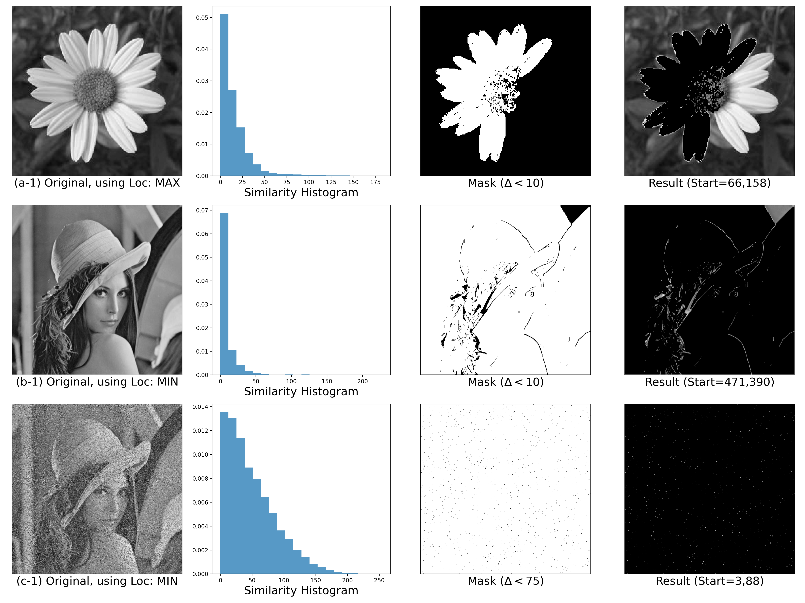
  

From the above figures, we may observe that

+ the algorithm is sensitive to noise
+ the algorithm is rather sensitive to the choice of similarity function and starting points, by observations
  + (simple image) only half of the flower is extracted
  + (complex image) significant boundaries are extracted, but not connected

>  + observe/analyze
>    + overall effect, by using different thresholds

  

    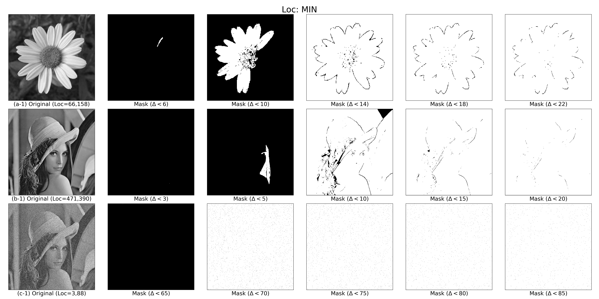
  

From the above figures, we may observe that

+ choice of threshold, taking effect with the choice of similarity function, is dominant the overall performance
+ with the current similarity function (abosulte difference of gray scale values), the larger the threshold, the less the boundaries are connected

#### TASK 4: Split and Merge Algorithm
> --- an algorithm for edge-detection-related purposes

>  + observe/analyze
>    + overall effect of simple & complex images
   

  

    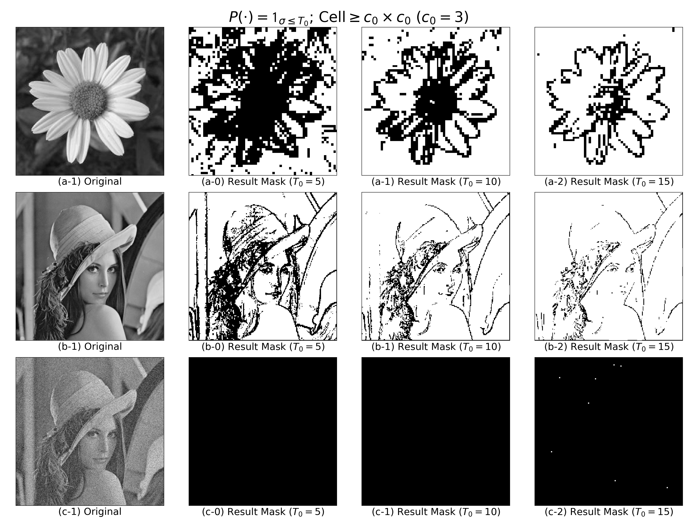
  

From the above figures, we may observe that

+ the algorithm is sensitive to noise
+ choice of threshold, taking effect with the choice of predicate, is dominant the overall performance
+ with the current predicate (astandard deviation), the larger the threshold, the better the boundaries are extracted

  

    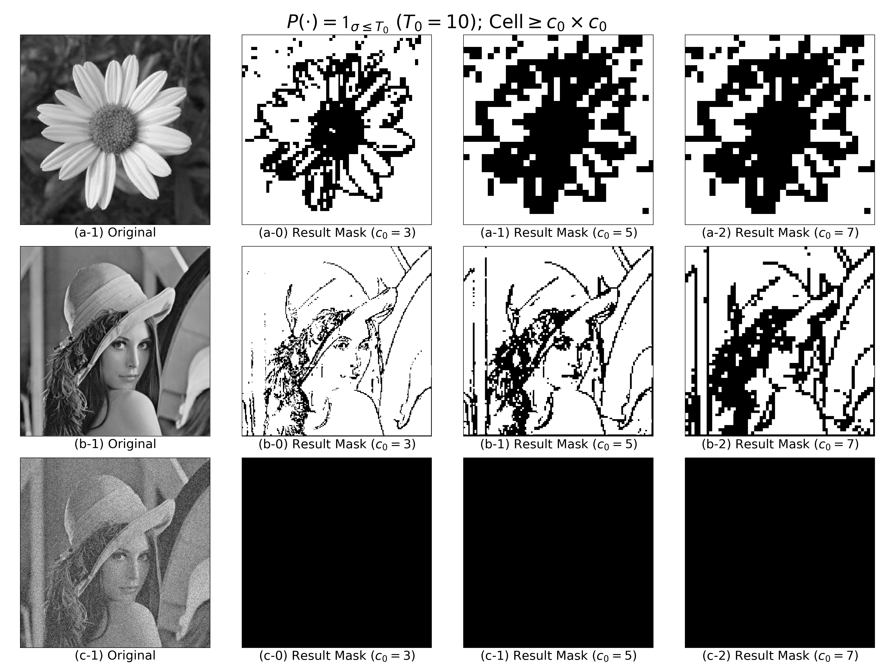
  

From the above figures, we may observe that

+ minimum sizes of regions have influence on the overall performance: the smaller the size, the more fine-grained the result

### Appendix

#### Codes
Please check the codes shipped with the report.

#### Reference
+ [Gaussian filter - Wikipedia](https://en.wikipedia.org/wiki/Gaussian_filter#Definition)
+ [python - How to calculate a Gaussian kernel matrix efficiently in numpy? - Stack Overflow](https://stackoverflow.com/questions/29731726/how-to-calculate-a-gaussian-kernel-matrix-efficiently-in-numpy)
+ [GaussianBlur() - OpenCV](https://docs.opencv.org/4.x/d4/d86/group__imgproc__filter.html#gaabe8c836e97159a9193fb0b11ac52cf1)
+ [filter2D() - OpenCV](https://docs.opencv.org/4.x/d4/d86/group__imgproc__filter.html#ga27c049795ce870216ddfb366086b5a04)
+ [Smoothing Images Examples - OpenCV](https://docs.opencv.org/4.x/d4/d13/tutorial_py_filtering.html)
+ [Sobel operator - Wikipedia](https://en.wikipedia.org/wiki/Sobel_operator)
+ [Sobel() - OpenCV](https://docs.opencv.org/3.4/d4/d86/group__imgproc__filter.html#gacea54f142e81b6758cb6f375ce782c8d)
+ [Sobel Derivatives - OpenCV](https://docs.opencv.org/3.4/d2/d2c/tutorial_sobel_derivatives.html)
+ [(Laplacian) Image Gradients - OpenCV](https://docs.opencv.org/4.x/d5/d0f/tutorial_py_gradients.html)
+ [Laplace Operator - OpenCV](https://docs.opencv.org/3.4/d5/db5/tutorial_laplace_operator.html)
+ [Laplacian() - OpenCV](https://docs.opencv.org/3.4/d4/d86/group__imgproc__filter.html#gad78703e4c8fe703d479c1860d76429e6)
+ [Canny Edge Detection Step by Step in Python - Towards Data Science](https://towardsdatascience.com/canny-edge-detection-step-by-step-in-python-computer-vision-b49c3a2d8123)
+ [OpenCV 区域生长算法（含代码）- CSDN](https://blog.csdn.net/qq_40467656/article/details/109288458)
+ [c# - Image segmentation - Split and Merge (Quadtrees) - Stack Overflow](https://stackoverflow.com/questions/7050164/image-segmentation-split-and-merge-quadtrees)
+ [图像分割之区域分离 - CSDN](https://blog.csdn.net/youcans/article/details/124496034)

